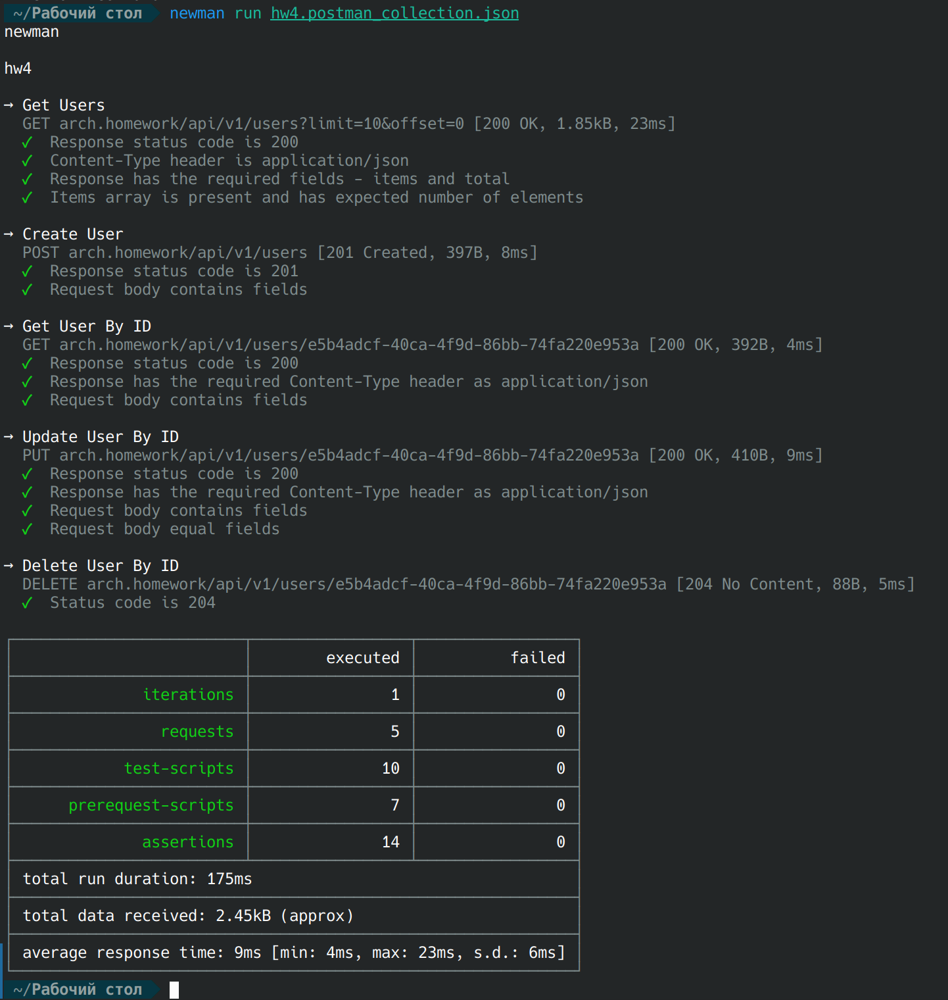

# Решение

Сделал веб-сервис на Golang для работы с пользователями почти как в примере
с небольшими доработками. Исходники сервиса [тут](https://github.com/andy-takker/simple_server).

В `./swagger.yaml` лежит актуальная схема сервиса.

В `./hw4.postman_collection.json` коллекция с тестами Postman, приложен скриншот
запуска коллекции локально `./newman_collection_run.png`.

.

В манифесты были добавлены 3 файла:

- `configmaps.yaml` с общими параметрами
- `secrets.yaml` с чувсттвительными данными для подключения к БД
- `database.yaml` со всеми настройками БД:
  - `Service` - для обращения ко всем экземлярам БД как одному узлу
  - `StatefulSet` - непосредственно описание подов БД с постоянным хранилищем
  - `Job` - для применения миграций

## Запуск

Для запуска решения необходимо просто выполнить: `kubectl apply -f ./manifests`.

Джоба с миграциями перезапускается, пока не применится к БД, поэтому отдельно
запускать ее не надо.

После запуска проекта можно запустить тесты: `newman run ./hw4.postman_collection.json`
